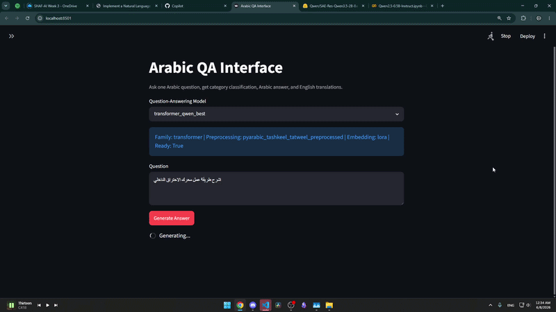

# Arabic NLP Project

An Arabic NLP project that explores **text classification**, **question answering**, **translation**, **retrieval-augmented generation**, preprocessing strategies, traditional machine learning models, transformer models, and an interactive Streamlit/FastAPI interface.

The project focuses on Arabic educational question-answering data and compares how different preprocessing methods, feature representations, and models affect performance.

---

## Interface Demo



---

## Traditional ML Experiment Overview

This visualization shows all traditional model combinations tested in the project:

**Dataset → Word Embedding / Feature Representation → Model → Macro F1**


The plot summarizes how different Arabic preprocessing strategies, embedding methods, and classifiers affected the final Macro F1 score.

---

## Project Tasks

| Task | Description |
|---|---|
| Arabic Text Classification | Classifies Arabic questions into predefined categories |
| Arabic QA Generation | Generates answers for Arabic questions |
| Machine Translation | Translates Arabic question-answer data |
| RAG Question Answering | Uses retrieval-based context for answering questions |
| Model Comparison | Compares traditional ML, Seq2Seq, and transformer-based approaches |
| Interface Deployment | Runs a FastAPI backend with a Streamlit frontend |

---

## Main Experiments

### 1. Arabic Preprocessing

Several preprocessing versions were tested, including:

- Original raw Arabic text
- PyArabic preprocessing
- Hamza normalization
- Tashkeel handling
- Tatweel removal
- Punctuation-focused preprocessing
- Regex aggressive preprocessing

The goal was to test whether Arabic text normalization improves classification and generation performance.

---

### 2. Traditional Machine Learning Classification

Traditional ML models were trained using multiple feature representations:

| Feature Type | Description |
|---|---|
| BoW | Bag-of-Words sparse word-count representation |
| TF-IDF | Term frequency-inverse document frequency |
| Word2Vec-CBOW | Dense word embeddings trained using CBOW |
| Word2Vec-SG | Dense word embeddings trained using Skip-Gram |
| FastText | Subword-aware word embeddings |
| BERT | Transformer-based embeddings |
| GPT | Transformer-based embeddings |

Models compared:

- Linear SVM
- XGBoost
- Multinomial Naive Bayes

---

### 3. Transformer Classification

Transformer-based classification was tested to compare deep contextual embeddings against traditional ML methods.

---

### 4. Question Answering

The project also includes Arabic question-answering experiments using:

- Seq2Seq models
- Transformer-based generation models
- RAG-based retrieval and answering

---

## System Architecture

```text
Arabic Question
   ↓
Preprocessing
   ↓
Classification / QA / RAG Pipeline
   ↓
Model Inference
   ↓
Prediction or Generated Answer
   ↓
Streamlit Interface
````

---

## Running the Project

Install dependencies:

```bash
pip install -r requirements.txt
```

Start the backend API:

```bash
uvicorn app_api:app --reload
```

Start the Streamlit interface:

```bash
streamlit run app_ui.py
```

---

## Repository Structure

```text
Arabic-NLP-Project/
│
├── app_api.py                          # FastAPI backend
├── app_ui.py                           # Streamlit frontend
├── requirements.txt                    # Dependencies
│
├── preprocessing.ipynb                 # Arabic preprocessing pipeline
├── classification_traditional_ml.ipynb # Traditional ML classification
├── classification_transformer.ipynb    # Transformer classification
├── machine_translation.ipynb           # Translation experiments
├── question_answering_seq2seq.ipynb    # Seq2Seq QA
├── question_answering_rag.ipynb        # RAG QA
│
├── AAFAQ_Dataset.csv                   # Original dataset
├── AAFAQ_Dataset_Translated.csv        # Translated dataset
│
├── classification plots/               # Classification visualizations
├── preprocessed datasets/              # Processed dataset versions
├── QA_seq2seq_outputs/                 # Seq2Seq QA outputs
├── QA_transformer_outputs_final/       # Transformer QA outputs
└── classification_seq2seq2_outputs/    # Classification outputs
```

---

## Key Features

* Arabic text preprocessing and normalization
* Traditional ML model comparison
* Transformer-based classification
* Arabic question-answering generation
* Retrieval-augmented question answering
* Machine translation pipeline
* Streamlit user interface
* FastAPI inference backend
* Visual analysis of model performance

---

## Why This Project Matters

Arabic NLP is challenging because Arabic has rich morphology, different writing forms, optional diacritics, spelling variation, and preprocessing sensitivity.

This project investigates how preprocessing choices and embedding methods affect Arabic NLP performance across multiple modeling approaches.

---

## Limitations

* The dataset size limits generalization.
* Some generated answers may be semantically weak even when similarity metrics look acceptable.
* Traditional ML models depend heavily on preprocessing quality.
* Transformer models require more compute and careful fine-tuning.
* RAG performance depends on the quality of retrieved context.

---

## Future Work

* Improve Arabic answer generation quality
* Add better transformer fine-tuning
* Add larger Arabic datasets
* Improve RAG retrieval quality
* Add model confidence explanations
* Dockerize the full application
* Deploy the interface publicly

---

## Tech Stack

* Python
* PyTorch
* Hugging Face Transformers
* scikit-learn
* XGBoost
* FastAPI
* Streamlit
* Pandas
* NumPy
* PyArabic
